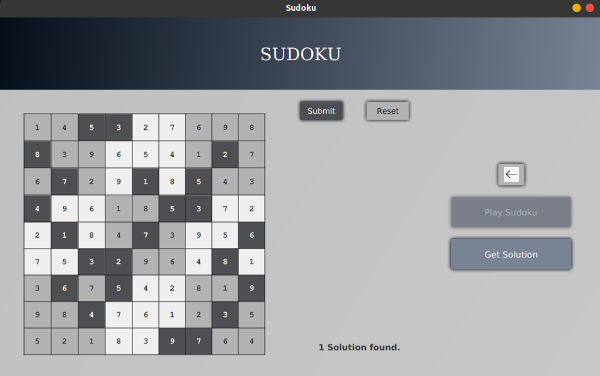
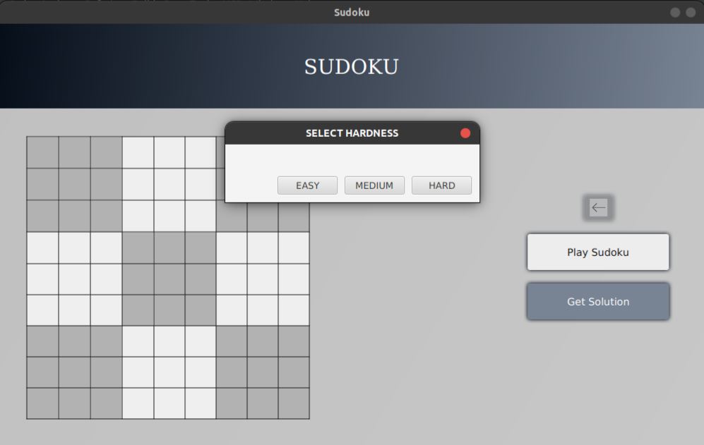
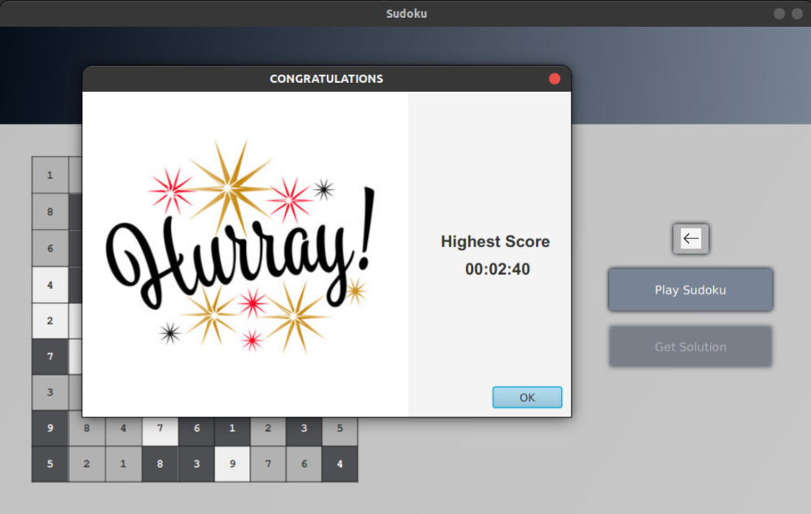

# **SUDOKU GAME**

## Getting Started
 This is a standalone project written completely in Java and uses JavaFX libraries for User Interface. To run this application on system, one must have pre-installed Java Development Kit (JDK). This project uses the latest version of Oracle JDK till date (JDK-16) and Maven architecture for the external JavaFX libraries. It is recommended to go with the same setup. To check the version of installed JDK, one can type `java --version` in terminal window. It can run on any platform irrespective of the system architecture, one of the perks of working with Java.
 Following setups are required for the application to run :
* Java 15 or later versions : [https://www.oracle.com/java/technologies/javase-downloads.html][Oracle Java SE Downloads] 

[Oracle Java SE Downloads]: https://www.oracle.com/java/technologies/javase-downloads.html 

* Apache Maven 3.8.1 : [https://maven.apache.org/download.cgi][Apache Maven Downloads]
                       [https://maven.apache.org/install.html][Apache Maven Installation]

[Apache Maven Downloads]: https://maven.apache.org/download.cgi
[Apache Maven Installation]: https://maven.apache.org/install.html

Once downloaded, navigate to the project folder and execute the following commands on terminal to run :
    
    mvn install
This will download the dependencies of the project on local repository. Then, the following command to run the application.
    
    mvn clean javafx:run

***

The application can run using the jar file too. Download it on your system, and you need JavaFX SDK.
* JavaFX SDK : [https://gluonhq.com/products/javafx/][Gluon JavaFX]

[Gluon JavaFX]: https://gluonhq.com/products/javafx/
  

    java -jar Sudoku-1.0.0.jar --module-path /path_to_javafx-sdk/lib --add-modules javafx.controls,javafx.fxml

The above command executes the Application.

* **

## Key Features
The application is for puzzlers, who love brainstorming puzzles.

* Play Sudoku with variations in levels.
* Solve an unsolved sudoku by generating it.
* The Application uses various threads to avoid lag in the game.
* Interface is beautiful.
* **Generate hard sudoku in no time. The algorithm focuses on randomization process which makes it efficient.**

Below are some glimpses of the application interface.

***

